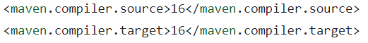
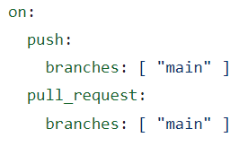
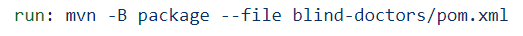

# Build keretrendszer és CI beüzemelése
A CI beüzemeléséhez a _Maven build keretrendszer_-t választottuk, amely hatékonyan segíti a projektünk építését és folyamatos integrációját.
 
A meglévő projektünkbe az _IntelliJ IDEA_ fejlesztői környezetben generáltuk le a _pom.xml_ fájlt, amely a _Maven_ projekt konfigurációját tartalmazza.
 
A GitHub-on létrehoztunk egy új _Action_-t, amely lehetővé teszi a _Maven_ futtatását. Ehhez létrehoztunk egy _maven.yml_ fájlt, amely tartalmazza az _Action_ konfigurációját és beállításait a _Maven_ folyamat futtatásához.
 
A továbbiakban a fent említett _pom.xml_ és a _maven.yml_ fájlokban végeztünk módosításokat a projektünk megfelelő konfigurálásához:

 

## Beállítások a _pom.xml_ fájlban:

- Projekt azonosító mező felvétele

- Java projekt verzióinak megadása fordításhoz

 

## Beállítások a _maven.yml_ fájlban:

- A _Maven build_ futását kezdeményező github események megadása

- Futtatás parancs megadása a _pom.xml_ fájl elérési útjával

