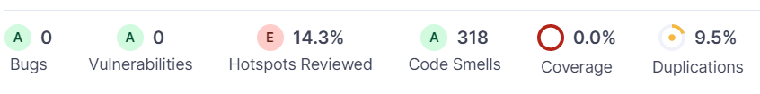

# Manuális kód átvizsgálása és Statikus analízis eszköz futtatása

## Manuális kód átvizsgálás
A feladatrész megoldását azzal a lépéssel kezdtük, hogy részletesen átvizsgáltuk a kódot, ezzel lehetővé téve minden csapattagnak a projekt átlátását és megértését. Ezáltal részletesen elemeztük a kódstruktúrát, az elnevezéseket, a függvények helyességét, valamint a potenciális hibák és sebezhetőségek jelenlétét.
 
A kód átvizsgálása után kijavítottuk a hibákat és a  nehezen átlátható kódrészeket.

## Statikus analízis
Az általunk választott megoldás a statikus analízishez a SonarCloud, amelyet könnyedén össze lehet kötni a GitHub platformmal.  A SonarCloud futtatásához létrehoztunk egy új action-t a GitHub-on, amelyhez elkészítettük a szükséges _.yml_ fájlt. Ez az új action lehetővé teszi, hogy automatikusan futtassuk a SonarCloud statikus analízisét a projektünkben. A _.yml_ fájlban megadtuk azokat a beállításokat és konfigurációkat, amelyek szükségesek a SonarCloud helyes működéséhez. A legfontosabb beállítások az alábbiak voltak:
- SonarCloud API-jához való hozzáférést biztosító Tokenek megadása

- Git események megadása, amelyekre automatikusan lefut az analízis

- Futtatás parancs leírása

A _.yml_ konfigurációs fájl létrehozásán kívül a projektünket leíró _pom.xml_ fájlt is módosítottuk. A tulajdonságokhoz hozzáadtunk két új mezőt, amelyekkel megadjuk a SonarCloud URL-jét, valamint a szervezet nevét. Ezek az alábbi képen láthatóak.

 

A SonarCloud sikeres konfigurálását követően egy pull request végrehajtása után lefut a statikus analízis a projektünkön. A SonarCloud webes felületén megtekinthető az analízis eredménye.

A feladatrész teljesítése során a statikus analízis által írt hibákat kijavítottuk a projektünkben

